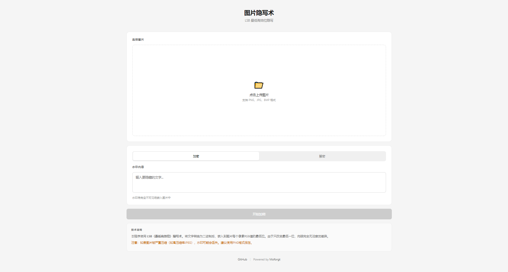

# 图片隐写术

基于 LSB（最低有效位）技术的图片隐写工具，可在图片中嵌入不可见的水印文字。

## 预览图



## 功能特点

- 🔒 **加密**：将文字水印不可见地嵌入图片中
- 🔓 **解密**：从图片中提取隐藏的水印内容
- 👁️ **肉眼不可见**：水印完全隐藏在像素中，不影响图片观感
- 🛡️ **格式转换无法去除**：水印嵌入像素最低位，普通格式转换无法去除

## 技术原理

LSB（Least Significant Bit）最低有效位隐写术，将文字转换为二进制后，嵌入到图片每个像素 RGB 值的最低位。由于只改变每个颜色通道的最低一位，肉眼完全无法察觉差异。

## 使用说明

### 加密流程
1. 选择「加密」模式
2. 点击上传区域选择要加密的图片
3. 输入要隐藏的水印文字
4. 点击「开始加密」按钮
5. 加密完成后，点击「下载加密图片」保存

### 解密流程
1. 选择「解密」模式
2. 上传已加密的图片
3. 点击「开始解密」按钮
4. 水印内容将以弹窗形式显示

## 注意事项

- 建议使用 PNG 格式保存加密后的图片
- 高压缩率的 JPEG 可能会导致水印丢失
- 水印容量取决于图片尺寸（约 图片像素数 × 3 ÷ 8 字节）

## 技术栈

- Vue 3 + Composition API
- 原生 Canvas API 处理图片像素
- 纯前端实现，无需后端服务

## 浏览器支持

- Chrome 80+
- Firefox 75+
- Safari 13+
- Edge 80+

## 安装运行

```bash
# 克隆仓库
git clone https://github.com/MoForgt/LSB-Tool.git
cd LSB-Tool

# 安装依赖
npm install

# 开发模式
npm run dev

# 构建
npm run build
```

## License

[MIT](LICENSE)
